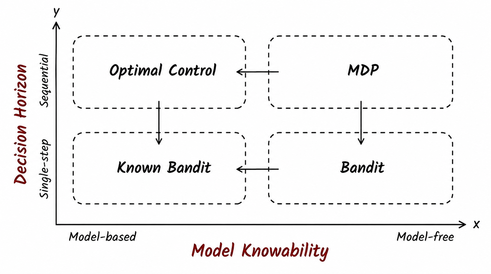
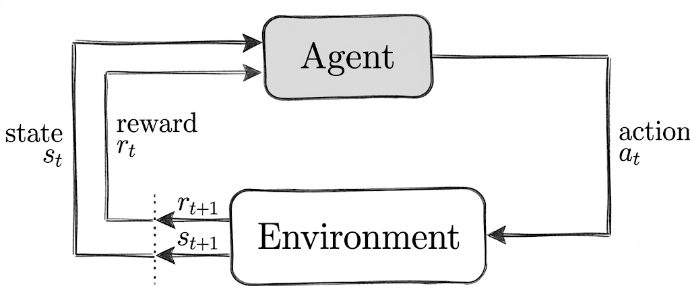

# Every AI Researcher Should Rethink MDP

## Introduction: Why Are We Still Studying MDP in 2026?

From 2025 to 2026, MDP—a concept born in the last century—experienced an unexpected revival, and in a peculiar way: it was revived under siege. DeepSeek-R1 used GRPO to elicit long-chain reasoning from LLMs, and subsequent papers pointed out that GRPO makes degenerate assumptions about MDP, rendering it essentially equivalent to filtered iterative supervised learning. Almost simultaneously, Ben Recht at UC Berkeley ignited a more fundamental debate in the community—he bluntly declared MDP and dynamic programming to be "red herrings," arguing that RL does not need this formalism: sample, score, update—three steps suffice. Critics quickly countered: once the objective is to maximize expected cumulative discounted reward, the Bellman structure emerges naturally in the derivation; it is not something you can discard at will.

These two events appear unrelated—one concerns LLM training techniques, the other a philosophical debate about RL—but they press upon the same question: **when someone claims a method is "RL," on what grounds do you make that judgment?** The answer is not hidden in the related work section of some paper; it is hidden in your understanding of the underlying structure of MDP. Without understanding it, you can only parrot others' conclusions; with it, you can deconstruct the foundational assumptions of any algorithm yourself.

However, this article takes a different approach from typical MDP tutorials. We will not linger on the surface of the five-tuple. Instead, we will subject MDP to **two extreme degenerations** and observe what it becomes when it loses certain elements. In brief: if the state space is reduced to a single state, MDP degenerates into the **multi-armed bandit**—exposing the most fundamental exploration-exploitation dilemma of reinforcement learning; if we assume the agent has complete knowledge of the environment, MDP degenerates into an **optimal control problem**—revealing the recursive structure of optimal decision-making. The full MDP stands at the intersection of the two: **the world changes in response to your decisions, and your understanding of the world is incomplete**. Once you grasp these two degenerations, you have seized the two core dimensions of reinforcement learning algorithm design.

---

Let us begin with the simplest possible question. You stand at the entrance of a maze, facing three branching paths. You do not know which one leads to the exit, nor how long each path is. You can only take one step at a time—at each new fork, you make your next choice. Your goal is to find the exit as quickly as possible.

This problem appears simple, yet it contains nearly all the core elements of reinforcement learning: you need to **explore** the unknown (which path to take?), you need to **exploit** what you know (this path looks promising—keep going?), and every choice you make affects not only your immediate progress but also where you will stand in the future. Reinforcement learning is about solving precisely this kind of problem: learning optimal decisions through trial and error in an unknown environment.

The mathematical language that reinforcement learning uses to describe such problems is called the **Markov Decision Process** (MDP). MDP is the cornerstone of reinforcement learning not merely because it describes how the world "really" works, but because it provides a precise mathematical language for stating the problem—what constitutes good behavior (maximizing return), how to define good behavior (value functions), and what structure good behavior should satisfy (the Bellman equation). With this language, we can then discuss "how to approximate this structure when the model is unknown"—and that, in its entirety, is what reinforcement learning is about.

<!--more-->

Ready? Let us begin with the Markov chain.

## Markov Chains and the Markov Property

Before introducing "decisions," let us first consider a simpler problem: how a system evolves on its own over time.

Imagine you are observing the weather in Shenzhen. Each day's weather can be one of three states: sunny, cloudy, or rainy. Today's weather affects tomorrow's weather—sunny days are more likely to be followed by more sun, rainy days are more likely to be followed by clouds. If we string together the states day by day, we obtain a **state chain**:

Each arrow represents the rule that "the state at the next moment depends only on the current state." This is the core structure of a **Markov Chain**.

So what exactly does "depends only on" mean? Let us write it out mathematically. Suppose we stand at time $t$, knowing the entire history from the beginning $s_1, s_2, \dots, s_t$, and we wish to predict the next state $s_{t+1}$. The **Markov Property** requires:

$$
P(s_{t+1} \mid s_t, s_{t-1}, \dots, s_1) = P(s_{t+1} \mid s_t)
$$

The two sides are always equal. This means that, given the current state $s_t$, all earlier history—$s_{t-1}, s_{t-2}, \dots$—is **redundant** for predicting $s_{t+1}$. More precisely, $s_t$ is a **sufficient statistic** for $s_{t+1}$: given $s_t$, $s_{t+1}$ is conditionally independent of all prior history.

Put plainly, the Markov property requires that the state we receive from the system is like a baton in a relay race—you take it from the previous runner, and you do not need to find the runner before that. The baton itself already carries all the information needed to continue the race.

Let us use weather forecasting to build intuition. If Shenzhen's weather truly satisfied the Markov property, then we would only need today's weather to make a "fully informed" prediction about tomorrow's weather. Whether your prediction is accurate or not, at the information level you have done everything you can—past information is completely summarized by today's weather. In reality, however, weather often does not satisfy the Markov property: the weather trend over the past several days (e.g., "it has been sunny for five consecutive days") carries information that would make your prediction more accurate. To make a better prediction, you might need to keep a record of several past days locally.

**Note** a subtle point about "sufficiency" that is easy to overlook. The Markov property is not about "how much information the current state contains," but about "whether the current state completely summarizes all history-relevant information about the future." A state can contain very rich information (e.g., a high-resolution photograph), but if it omits some factor present in the history that affects the future, it still fails to satisfy the Markov property. Conversely, a seemingly simple state—as long as it captures all factors that influence the future—does satisfy the Markov property.

So far, we have discussed how a system evolves passively on its own—how states change is entirely determined by natural laws. But the problems that reinforcement learning aims to solve are more complex: there is an **agent** in the system that actively makes **decisions**, and the environment provides **rewards** as feedback.

So, what do we get when we pack decisions and rewards into a Markov chain?

This is the **Markov Decision Process** (MDP). It adds two things on top of the Markov chain: **actions** and **rewards**. The agent selects an action at each state; the environment transitions the agent to the next state according to that action and issues an immediate reward. The agent's objective is to maximize long-term cumulative reward. Roughly speaking, an MDP consists of five elements—state space, action space, state transition probabilities (given a state and action, the probability distribution over next states), reward function, and discount factor (how much to discount future rewards).

Note that this definition embeds two core features simultaneously. First, **the world changes in response to your decisions**—you choose different actions, and the state trajectory differs. Second, **your understanding of the world is incomplete**—you do not know the true values of transition probabilities and reward functions; you can only learn through trial and error. These two features are independent of each other: you can imagine a world where your decisions do not affect the state trajectory (only uncertainty remains); you can also imagine another world where you know the transitions and rewards perfectly (only decision-dependence remains). These two extremes are precisely the two degenerations of MDP.

Let us begin with these two degenerations. Strip away one dimension, and the remaining dimension is illuminated more clearly. We start with the first degeneration.

## Degeneration I: State Disappears — The Multi-Armed Bandit

### When the Entire World Consists of a Single State

Let us first make an extreme degeneration: remove the state transition. Suppose the state space contains only one state—no matter what action the agent takes, the environment always returns to the same state. In this case, the consequences of actions are settled entirely within a single step, with no long-term effects.

MDP is flattened: state transitions lose their meaning (because you always return to the same state), and the discount factor exits the stage (because there is no "future" to discount). What remains is a naked question: **given a finite number of attempts, how should you allocate your choices among several unknown options to maximize total payoff?**

This degenerate problem is the **Multi-Armed Bandit**. The name comes from casino slot machines—you face several slot machines, each with a different and unknown payout rate; you can pull only one arm at a time, and your goal is to maximize total winnings over 100 pulls. Each pull's outcome affects only that round's payoff and does not change the machine's state.

The most worthwhile question to ask about this degeneration is: **after MDP has been thoroughly flattened, what is the most stubborn core problem that remains?**

The answer is: **decision-making under uncertainty**. When you strip away all structure, the irreducible core that remains is called **the unknown**. And reinforcement learning, in the final analysis, is the study of how to make decisions in the face of the unknown.

### The Exploration-Exploitation Tradeoff

Simple as the bandit problem is, it exposes the most fundamental dilemma in reinforcement learning: the tradeoff between **exploration** and **exploitation**.

Let us experience this dilemma through a concrete numerical example. Suppose you face three slot machines with true expected payoffs of 0.5, 0.7, and 0.3 respectively. You know none of these numbers; you can only estimate them through repeated pulls. You have 100 pulls in total.

- If you choose **exploitation**: you pull the first machine 10 times and find an average payoff of 0.45. Great—it looks better than the other two! So you bet all your remaining 90 pulls on the first machine. But you will never discover that the second machine's true expected payoff is 0.7—you were deceived by your own small sample from the early stage.
- If you choose **exploration**: you evenly distribute your 100 pulls across the three machines, pulling each about 33 times, eventually learning each machine's true payout rate precisely. But you no longer have enough opportunities to concentrate your bets on the best machine—you squandered too many precious trials on confirming "which one is the worst."

This dilemma is not a bug in the bandit problem but a feature. The very fact that it is a dilemma means it can never be "solved" once and for all—it can only be traded off. Every strategy must make a compromise between the two, and the specific manner of that compromise determines how much payoff you ultimately obtain.

This tradeoff exists in the full MDP as well, and it is even harder. Because in an MDP, the choices you make today affect not only today's reward but also where you will stand tomorrow. Taking a detour today for exploration might lead you to an entirely new, more valuable region—in the bandit setting, this kind of "long-term dividend of exploration" does not exist. But precisely because the bandit setting eliminates the "long-term dividend" dimension entirely, it allows us to study the mathematical structure of exploration in its **pure** form.

### The Origins of Exploration Strategies: From Bandits to Deep RL

The bandit is not merely a degenerate version of MDP; it is the "grammar book" of exploration strategies in RL algorithm design. Nearly every exploration strategy can find its prototype in bandit theory.

**$\varepsilon$-greedy** is the most naive exploration strategy: with probability $\varepsilon$, choose an action randomly; with probability $1-\varepsilon$, choose the current best action. It is also the default option for DQN. But it has a fundamental flaw—$\varepsilon$ is fixed and does not change as your knowledge of the environment improves. You have pulled the first machine 1,000 times and know it inside out, yet you still have probability $\varepsilon$ of engaging in meaningless random exploration. Worse still, in an MDP, different states require entirely different amounts of exploration—near the maze entrance you need extensive exploration to find the direction of the exit, but in an obvious dead end you need almost none. A globally fixed $\varepsilon$ cannot distinguish between these two cases.

This deficiency gave rise to three lines of improvement, each answering a different version of the same question: **how do you maintain openness in the face of uncertainty?**

**The first approach: optimism—assign a high valuation to the unknown.** The Upper Confidence Bound (UCB) algorithm does not merely look at each machine's average payoff; it also adds an "uncertainty bonus"—the less you know, the larger the bonus. Then it selects the machine with the highest total score. This embodies a deep philosophy: **when you lack knowledge of the world, treat the unknown as a potential opportunity rather than a threat**. Projected into deep RL, this idea becomes count-based exploration and Random Network Distillation (RND)—both attempt to quantify "how unfamiliar a state is" and then grant unfamiliar states additional exploration bonuses.

**The second approach: probabilism—maintain a belief distribution over the world.** Thompson Sampling works as follows: rather than asking "what is the expected payoff of this machine," it maintains a posterior distribution over each machine's parameters, samples from this distribution before each pull, and selects the machine with the highest sampled value. This means exploration naturally emerges from **epistemic uncertainty**—the more uncertain you are about a machine, the greater the fluctuation in its sampled value, and the more likely it is to win out in a given sampling round. Projected into deep RL, this becomes Bayesian RL.

**The third approach: write exploration into the objective function.** Maximum-entropy reinforcement learning (SAC) does not aim to "maximize cumulative reward" but to "maximize cumulative reward plus policy entropy"—all else equal in terms of reward, SAC naturally prefers more stochastic policies. This is not about sticking an exploration patch onto the reward function; it is about embedding exploration into the optimization objective itself.

All four strategies trace their origins to the bandit, yet their destinations are value-function methods, policy gradient methods, and other seemingly disparate deep RL algorithms. Once you understand the bandit, you can see the kinship among them.

The bandit teaches us more than just exploration strategies. It also reveals the fundamental impact of reward temporal structure on learning difficulty.

### Reward Delay: Credit Assignment from the Bandit Perspective

The bandit teaches us one more thing, and it concerns the **temporal structure** of rewards.

In the bandit, there is no delay between action and outcome—you pull the lever, the coin drops immediately, and whether it is good or bad is clear at a glance. This is **immediate feedback**. But in a full MDP, a critical decision may only reveal its consequences a hundred steps later. In a game of Go, the opening 150 moves are laid out, and the final win or loss is the only true signal. Between action and outcome stretches a long span of time—this is **delayed reward**.

The core difficulty introduced by delay is called **credit assignment**: when reward finally arrives, how do you determine which actions along the way deserve the credit? From the bandit perspective, the severity of this problem can be measured as follows: **the difficulty of exploration in an MDP is roughly proportional to how "unlike a bandit" it is—that is, the temporal distance between critical decisions and the reward signal**. The longer the distance, the harder it is to discern the true causal chain from noise. In extremely sparse reward settings—for example, a maze where you only receive +1 upon reaching the exit—the agent receives almost no effective feedback during early random exploration, and learning efficiency plummets.

This actually brings us back to the bandit's core insight: **the more immediate and direct the reward, the more efficient the learning**. The difficulty of MDP stems, to a large extent, from the fact that its rewards are not as immediate as those in the bandit. Once you understand this, you understand why sparse rewards are among the most intractable challenges in RL.

## Degeneration II: Model Known — The Optimal Control Problem

Now let us degenerate MDP from the other direction: preserve the full state transition structure, but remove the **unknownness** of the model.

### The Symmetry of the Two Degenerations

In the first degeneration, we removed state transitions—the world no longer changes in response to your decisions, but you remain uncertain about the payoffs of your options. Now we do the opposite: preserve the full structure of state transitions (including stochasticity), but assume you hold a **complete map** in your hands—you know the exact values of transition probabilities and reward functions at every state.

This is what we call "Degeneration II." It forms a perfect conceptual symmetry with Degeneration I:

- **The bandit degeneration lies on the "decision" axis**: you still have to make decisions (which machine to pull), but the world no longer changes in response to your decisions.
- **This degeneration lies on the "information" axis**: the world still changes in response to your decisions (moving from one state to another), but you know this world inside out.

The full MDP stands at the intersection of the two—**the world changes in response to you, and your understanding of the world is incomplete**. This symmetry is key to understanding the design space of RL algorithms.

### Bellman's Principle of Optimality

The first and most essential insight revealed by this degeneration is called **Bellman's Principle of Optimality**, which states:

> An optimal policy has the property that whatever the initial state and initial decisions are, the remaining decisions must constitute an optimal policy with regard to the state resulting from the first decisions.

Let us illustrate with the maze. Suppose the shortest path from the start to the exit passes through cell G. Then the segment from G to the exit must also be the shortest path from G to the exit. If a shorter path from G to the exit existed, you could simply replace the original second half with it, making the entire path shorter—contradicting the premise that it was the "shortest path."

This property, which may seem like a tautology, is in fact the entire reason dynamic programming works. Because it tells us: **optimal decisions possess optimal substructure**—the optimal solution to a large problem can be assembled from optimal solutions to smaller problems.

Let us turn this idea into an algorithm using a classic dynamic programming problem. **Coin change**: you have coins of denominations 1, 5, and 11 in unlimited supply. What is the minimum number of coins needed to make 15? A greedy strategy says "take 11 first, then four 1's"—5 coins total—but three 5's requires only 3 coins. Greedy fails.

The dynamic programming approach: let $f(n)$ be the minimum number of coins needed to make $n$. Considering the denomination of the last coin, we obtain the recurrence:

$$
f(n) = \min\{\, f(n-1) + 1,\; f(n-5) + 1,\; f(n-11) + 1 \,\}
$$

$f(0) = 0$. Fill the table from small to large:

| n    | 0   | 1   | 2   | 3   | 4   | 5   | 6   | 7   |
| ---- | --- | --- | --- | --- | --- | --- | --- | --- |
| f(n) | 0   | 1   | 2   | 3   | 4   | 1   | 2   | 3   |

| n    | 8 | 9 | 10 | 11 | 12 | 13 | 14 | 15 |
| ---- | - | - | -- | -- | -- | -- | -- | -- |
| f(n) | 4 | 5 | 2  | 1  | 2  | 3  | 4  | 3  |

$f(15) = \min(f(14)+1, f(10)+1, f(4)+1) = 3$. The optimal solution is three 5's.

Look back at this recurrence: **$f(n)$ depends only on the solutions to smaller subproblems, and each of those subproblem solutions is itself optimal**—optimal substructure.

This coin change problem can be fully wrapped as an MDP. Define the state as $(n, k)$—still need $n$ in change, have used $k$ coins so far. Initial state $(15, 0)$, terminal state $(0, k)$. Actions are choosing a coin $c \in \{1, 5, 11\}$, and transitions are deterministic: $(n, k) \xrightarrow{c} (n-c, k+1)$. Each coin used gives a reward of -1, and the objective is to maximize cumulative reward (i.e., minimize the number of coins). This is a standard MDP—states, actions, transitions, rewards, all fully specified.

The key point is this: once you know the transition rule (choosing $c$ reduces $n$ by $c$ and increases $k$ by 1), this problem degenerates into a model-known optimal control problem that can be solved exactly with dynamic programming. Conversely, if you do not know what the coin denominations are—each time you pick a number, the environment only tells you "too little," "too much," or "exact change"—then you must learn through trial and error, and that is precisely reinforcement learning.

If you have extensive experience solving algorithmic problems, you can probably recall many classic dynamic programming problems, and each one of them can be wrapped as an "MDP problem" that would require reinforcement learning to solve. This should give you an intuitive sense of why I say that the optimal control problem solved by dynamic programming is a degeneration of MDP.

**Note** that the essence of this degeneration is that the model is known, not that the transitions are deterministic. A model-known MDP is precisely an **optimal control problem**—dynamic programming (value iteration, policy iteration) is the standard algorithm for solving it, applicable to any known transition probabilities, whether the transitions are deterministic or highly stochastic. Deterministic transitions are merely a special case of model-known, not the core condition of the degeneration. In the RL literature, the standard terms for this dimension are **model-based** and **model-free**: model-based methods require or learn an environment model; model-free methods learn policies or value functions directly from interaction experience without explicitly modeling the environment.

### Value Iteration and Policy Iteration: Two Solution Philosophies

Knowing that a recursive structure exists, the remaining question is how to find that self-consistent solution. In the MDP context, dynamic programming gives us two algorithms, and the difference between them reveals a core fork in RL algorithm design.

**Value Iteration**: repeatedly update the value of each state using the Bellman optimality equation until convergence. In each round, we use $\max_a$ to ask "in this state, which action leads to the best future?" Its philosophy is: **first figure out the objective function, then back out the actions from it**. First compute how much each state is "worth," then go where the value is highest.

**Policy Iteration**: first evaluate the values of all states under the current policy (**policy evaluation**), then derive a better policy from these values (**policy improvement**), alternating between the two. Its philosophy is: **start with a policy, then revise it based on how it performs**. You do not need to know the optimal values from the outset—you only need to know "roughly how good the current policy is, and where there is room for improvement." The policy improvement step has a rigorous mathematical guarantee—if we select the action with the highest $Q$-value for each state (the greedy policy), the new policy is guaranteed to be no worse than the old one. That is, every step of policy iteration is a monotonic improvement; there is no scenario where "after the revision, it actually gets worse."

The distinction between these two algorithms produced far-reaching echoes in later deep RL: the philosophy of value iteration led to the DQN family—directly approximate the optimal $Q$ function, with the policy implicitly derived from the $Q$ function (strictly speaking, Q-learning uses temporal-difference updates rather than a full sweep of the Bellman optimality operator—we will precisely clarify the relationship between the two in a subsequent article). The philosophy of policy iteration led to the Policy Gradient → PPO family—explicitly maintain a policy and gradually improve it by estimating policy gradients through sampling.

Now let us place the two degenerations in the same picture. Degeneration I (bandit) and Degeneration II (optimal control) each occupy one dimension; the full MDP stands at their intersection. And if both axes degenerate to the extreme—neither state transitions nor reward uncertainty exist—we bottom out in the fourth quadrant of the "known-reward multi-armed bandit." In this setting, all temporal structure is drained away; the only thing you need to do is lock onto the action with the highest expected payoff and repeat it.

We have now seen the passive evolution of the Markov chain, the exploration dilemma of the bandit, and the recursive structure of the optimal control problem. What comes next is to merge the two dimensions—letting the world change in response to decisions while you lack complete knowledge of that world. Below, from the intersection of the two degenerations, we will go through the key structures of the full MDP as concisely as possible. For each concept we encounter, we will ask: what does it inherit from which degeneration?

## Where the Two Degenerations Meet: Key Structures of MDP

### Formal Definition of MDP

Before unfolding the discussion, let us first give the complete formal definition of MDP. An MDP consists of the following five elements:

$$
\langle \mathcal{S}, \mathcal{A}, \mathcal{P}, \mathcal{R}, \gamma \rangle
$$

- $\mathcal{S}$: **State space**. The set of all possible states.
- $\mathcal{A}$: **Action space**. The set of all possible actions.
- $\mathcal{P}$: **State transition probabilities**. $\mathcal{P}_{s,s'}^{a} = P(s_{t+1}=s' \mid s_t=s, a_t=a)$, describing the probability that the environment transitions to $s'$ after the agent takes action $a$ in state $s$.
- $\mathcal{R}$: **Reward function**. $\mathcal{R}_s^a = \mathbb{E}[r_{t+1} \mid s_t=s, a_t=a]$, describing the expected immediate reward after taking action $a$ in state $s$.
- $\gamma$: **Discount factor**. $\gamma \in [0, 1]$, controlling the weight placed on future rewards. The closer $\gamma$ is to 1, the more "farsighted" the agent; the closer to 0, the more "myopic." For finite-horizon tasks (e.g., Go, maze-solving), one may set $\gamma = 1$.

The core loop of MDP is: the agent observes a state → selects an action according to its policy → the environment returns a new state and reward → repeat. This diagram should already be very familiar to you:

### Actions and Policies

In a Markov chain, state transitions depend only on the current state itself: $s_t \to s_{t+1}$, with transition probability written as $P(s' \mid s)$. Now, we insert an **action** between two states—the agent observes the current state and actively makes a choice, and this choice affects where the state transitions to. The transition probability thus becomes:

$$
P(s' \mid s, a)
$$

Do not underestimate the addition of a single $a$ in the conditioning set—its mathematical consequences are profound. In a Markov chain, the state sequence is generated passively—given an initial state and transition probabilities, the distribution of the entire sequence is determined. But once actions are introduced, the state sequence depends on the agent's choices, and the agent's choices depend on what states it observes. This creates a **closed loop**—the agent and the environment influence each other, and neither can be separated from the other.

Let us return to the maze example to feel this concretely. Suppose you are a small figure navigating a maze:

- You currently stand on a certain cell—this is your **state**.
- You can choose to step up, down, left, or right—these are your **actions**.
- When you choose a direction, the environment determines which cell you stand on next based on the maze structure—this is the **state transition**.

**Note** that choosing "step up" does not guarantee you will actually move up. If there is a wall above, you will bounce back to your original position. This is the source of stochasticity in MDP—the transition probability $\mathcal{P}_{s,s'}^{a}$ captures this uncertainty about the world.

With states and actions in place, we need something to determine what action to take in a given state. This thing is called a **policy**, typically denoted as $\pi$.

For a stochastic policy, $\pi(a \mid s)$ denotes the probability of selecting action $a$ in state $s$:

$$
\pi(a \mid s) = P(A_t = a \mid S_t = s)
$$

Put plainly, a policy is a "code of conduct"—given a state, with what probability should each action be taken.

So why do we need stochastic policies? Can we not simply always pick the best action? There are two reasons. First, during training, we need to **explore**—occasionally picking actions that appear suboptimal to discover better possibilities. If you always take the path that "looks shortest," you may never discover that there is an even shorter path nearby whose entrance is hidden. Second, in certain settings (e.g., playing cards against an opponent), the optimal strategy is inherently stochastic—if your opponent can perfectly predict every move of yours, you lose.

The policy is one of the most central concepts in MDP. All the reinforcement learning algorithms we will discuss later—DQN, Policy Gradient, PPO, SAC—are essentially answering the same question: **how do we find a good policy?**

Looking back at the exploration strategies in Degeneration I, with the exception of UCB being deterministic, the sources of stochasticity in the other three differ: $\varepsilon$-greedy's stochasticity is an externally imposed perturbation; Thompson Sampling's stochasticity arises from epistemic uncertainty (the less you know, the larger the sampling fluctuation); SAC's stochasticity is directly written into the objective function itself. The philosophies of these three stochastic strategies correspond to three stances toward the unknown—forced probing, probabilistic prudence, and active embrace. The stochastic policy in the full MDP shoulders both missions simultaneously: it must exploit the currently known good actions while leaving a door open for actions that may prove better in the future.

### Reward, Return, and Value Functions: Defining What "Good" Means

With a policy in hand, we need a criterion to judge how good it is. This criterion is the **reward**.

At each state transition, the environment gives the agent immediate feedback. In maze navigation, hitting a wall gives -1, picking up a gold coin gives +10, walking on an empty path gives 0.

But the objective of reinforcement learning is not to maximize single-step rewards—that would be too myopic. We aim to maximize the long-term cumulative **return**:

$$
G_t = r_{t+1} + \gamma r_{t+2} + \gamma^2 r_{t+3} + \dots = \sum_{k=0}^{\infty} \gamma^k r_{t+k+1}
$$

where $\gamma \in [0, 1]$ is the **discount factor**, which discounts future rewards—1 point today is worth more than 1 point tomorrow. In infinite-horizon problems, $\gamma < 1$ ensures the series converges; for finite-length tasks (e.g., Go), one may set $\gamma = 1$. In the theoretical foundations of reinforcement learning, $\gamma < 1$ plays a critical role—it is precisely because of the discount factor that the Bellman operator (denoted $\mathcal{T}$) is a contraction mapping, guaranteeing that repeated iteration converges to the unique optimal solution. We will prove this rigorously in a subsequent article.

With the definition of return, we need a tool to predict it. The **value function** is that tool.

**State-value function** $V^\pi(s)$: starting from state $s$ and following policy $\pi$, what is the expected future return?

$$
V^\pi(s) = \mathbb{E}_\pi[G_t \mid s_t = s]
$$

**Action-value function** $Q^\pi(s, a)$: in state $s$, first take action $a$, then follow policy $\pi$ thereafter—what is the expected future return?

$$
Q^\pi(s, a) = \mathbb{E}_\pi[G_t \mid s_t = s, a_t = a]
$$

The relationship between $V$ and $Q$ is succinct: $V^\pi(s) = \sum_a \pi(a \mid s) \, Q^\pi(s, a)$—the value of a state is the expected $Q$-value obtained by selecting actions according to the policy.

**Note** that both $V$ and $Q$ are **predictions** that depend on the policy $\pi$. The same state holds a completely different value in the eyes of an expert versus a novice. The entire purpose of the value function is to provide a quantitative yardstick for the quality of a policy—with it, we can then discuss the task of "improving a policy."

We discussed the credit assignment problem in Degeneration I—the longer the reward delay, the harder it is to identify the causal chain between critical decisions and the feedback signal. The value function is precisely the tool for shortening this "causal distance": it compresses the long-term consequences of a long sequence into a single scalar, allowing you to receive meaningful feedback at every step. The $f(n)$ in the coin change problem from Degeneration II is the simplest value function—it tells you "starting from $n$, how many more coins do you need at minimum?" The $V$ and $Q$ of the full MDP are more general forms of the same idea.

### The Bellman Equation: The Mathematical Structure Connecting Both Degenerations

The definition of return $G_t$ itself implies a recursive structure:

$$
G_t = r_{t+1} + \gamma G_{t+1}
$$

"The current return = immediate reward + future return (discounted)." This is precisely the general form of the coin change recurrence $f(n) = \min\{f(n-c) + 1\}$ from Degeneration II—in that problem, the "future" was only one step away, whereas in the full MDP this recurrence unfolds along the entire trajectory.

Substituting this recurrence into the definition of the value function and taking expectations over actions and next states yields the **Bellman expectation equation**:

$$
V^\pi(s) = \sum_a \pi(a \mid s) \sum_{s'} \mathcal{P}_{s,s'}^{a} \left[ r(s, a, s') + \gamma V^\pi(s') \right]
$$

This equation is the mathematical foundation of **policy evaluation** from Degeneration II: given $\pi$, the $V^\pi$ values of all states must satisfy this self-consistency condition. The policy iteration algorithm from Degeneration II works by repeatedly solving this equation and then improving the policy based on the resulting values.

If we pursue not the value of a particular policy but the **optimal** value, we replace the policy-weighted average $\sum_a \pi(a|s)$ with $\max_a$. The most commonly used form is the **Bellman optimality equation for $Q^*$**:

$$
Q^*(s, a) = \sum_{s'} \mathcal{P}_{s,s'}^{a} \left[ r(s, a, s') + \gamma \max_{a'} Q^*(s', a') \right]
$$

This is the equation that **value iteration** in Degeneration II relies on. It differs from the expectation equation by only one operator: $\max$ replaces the policy-weighted average.

But what is truly important about this equation is its **structure**: $\max$ sits **inside** the expectation—first take the maximum over all actions at $s'$, then take the expectation over $s'$. This ordering means that to update $Q$-values, you **do not need to know the transition probabilities $\mathcal{P}_{s,s'}^{a}$**: you only need to sample $(s, a, r, s')$ and then look up which action has the highest $Q$-value in $s'$. The sampling itself implicitly approximates the distribution.

This is precisely the mathematical reason why Q-learning and DQN can perform **model-free** learning—and it is where the two degenerations meet at the mathematical level. The recursive structure from Degeneration II guarantees the existence of the optimal solution; the "unknownness" from Degeneration I forces you to approach it through sampling rather than analytic computation. The Bellman optimality equation conveniently supplies an iterative scheme that allows one to approximate the optimal value without knowing the model. We will provide a rigorous convergence proof for this in the next article.

### Two Traditions, One Equation

If we pull apart the history of RL, we discover something quite interesting.

In 1933, William Thompson published a paper on the multi-armed bandit in *Biometrika*—he was trying to solve a practical problem in clinical trials: how to allocate patients between two drugs of unknown efficacy such that as many patients as possible receive the better treatment. The Thompson Sampling algorithm he proposed essentially asks: **when you do not know which choice is better, how do you try and choose at the same time?**

In 1957, Richard Bellman published *Dynamic Programming* at the RAND Corporation—he was trying to solve multi-stage decision problems against the backdrop of the Cold War. The Bellman equation he proposed essentially asks a different question: **when you know the consequences of all choices, how do you work backward to derive the optimal policy?**

Two questions, asking about two sides of the same coin. But these two pioneers never crossed paths—Thompson was in a biostatistics department, Bellman in operations research and control systems. The two traditions developed independently for over half a century, until Sutton and Barto, mentor and student, placed them into a single framework in 1998.

The place where these two questions meet is the Bellman equation. There is a mathematical intuition here that is easy to overlook: **the Bellman equation is a fixed-point equation.** $V = \mathcal{T} V$, where $\mathcal{T}$ is the Bellman operator. Dynamic programming in Degeneration II can solve it exactly because $\mathcal{T}$ can be computed explicitly under a known model; Degeneration I does not need $\mathcal{T}$ because the recursive chain simply breaks with a single state. And the difficulty of the full MDP is this: $\mathcal{T}$ involves expectations over unknown transition probabilities, and we can only approximate this fixed point through sampling. All RL algorithms—Q-learning's stochastic approximation, PPO's policy gradient, SAC's soft Bellman update—are essentially answering the same question: **how do you approximate the fixed point of $\mathcal{T}$ when you do not know its exact form?**

Moreover, Bellman knew the weight of this matter from the very beginning. In that 1957 book, he coined the term "curse of dimensionality"—the state space explodes exponentially with dimensionality, making exact solutions to the Bellman equation impossible in practical problems. In this sense, **reinforcement learning is not a supplement invented after the fact; it is the inevitable path forward built into MDP from the day of its birth.**

Dimitri Bertsekas, on the frontispiece of his dynamic programming textbook, quotes Kierkegaard:

> Life can only be understood backwards, but it must be lived forwards.

The computation of value functions proceeds backward from the terminal state (looking backward); the execution of a policy proceeds forward from the initial state (living forward). The recursive structure of the Bellman equation is nothing more than these dozen or so words written in mathematical language. And RL asks one more question on top of it: **if you do not even have the map needed to look backward, do you still dare to move forward?**
