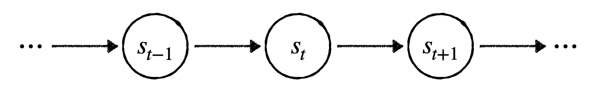
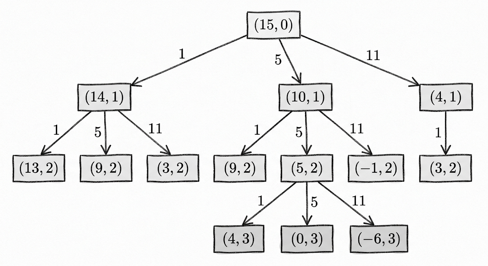
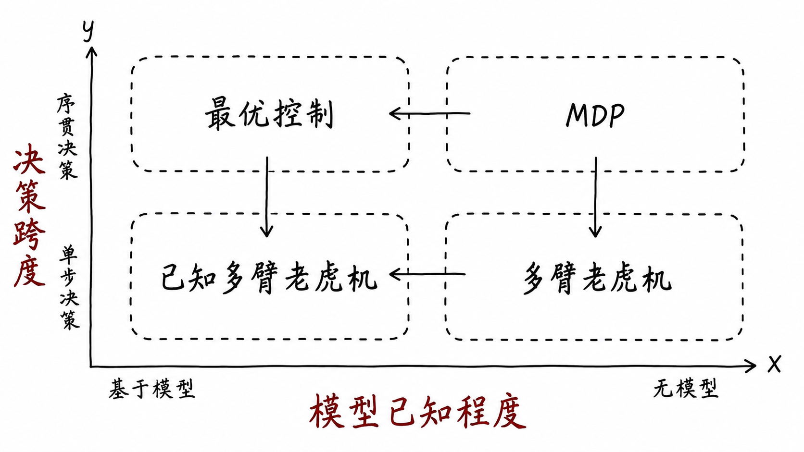
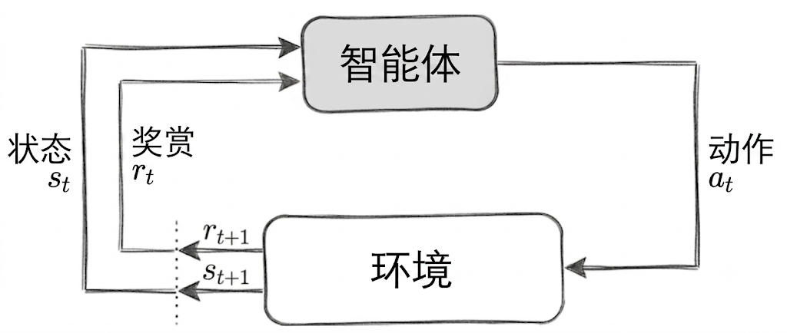

# 每个AI研究者都该重新思考一遍MDP

## 引言：为什么在2026年，我们还在学MDP？

2025 到 2026 年，MDP 这个诞生于上世纪的概念经历了一场意外的复兴——而且是以一种奇特的方式：它是被"围攻"着复兴的。DeepSeek-R1 使用 GRPO 让 LLM 涌现出长链推理，随后有论文指出 GRPO 对 MDP 做了退化假设，本质上等价于带过滤的迭代监督学习。几乎同时，UC Berkeley 的 Ben Recht 在社区中引爆了一场更根本的论战——他直言 MDP 和动态规划是"红鲱鱼"，RL 不需要这套形式化，采样、评分、更新三步足矣。反驳者随即指出：一旦目标函数是最大化期望累积折扣奖励，贝尔曼结构就会在推导中自然出现，不是想丢就能丢的。

这两件事看似无关——一个是大模型训练技巧，一个是 RL 哲学论战——但它们逼问的是同一个问题：**当有人说一个方法是"RL"时，你到底凭什么下判断？** 答案不藏在某篇论文的 related work 里，而藏在你对 MDP 底层结构的理解中。不理解它，你只能复述别人的结论；理解了它，你就能自己拆解任何算法的底层假设。

但本文的做法和常见的 MDP 教学文章不同。我们不会停留在五元组的表面，而是会对 MDP 进行**两种极端退化**，观察它在失去某些要素后会变成什么。简单来说：如果让状态空间只剩下一个状态，MDP 就退化为**多臂老虎机**——它暴露了强化学习最根本的探索-利用困境；如果假设智能体完全了解环境，MDP 就退化为**最优控制问题**——它揭示了最优决策的递归结构。完整 MDP 站在二者的交汇点上：**世界因你的决策而变，且你对世界的了解是不完整的**。理解了这两种退化，你就抓住了强化学习算法设计的两个核心维度。

---

让我们从一个最简单的问题开始。你站在一个迷宫的入口，面前有三条岔路。你不知道哪条通向出口，也不知道每条路有多长。你只能走一步看一步——每到一个新的岔路口，再做下一次选择。你的目标是尽快找到出口。

这个问题看似简单，但它包含了强化学习中几乎所有的核心要素：你需要**探索**未知（走哪条路？），你需要**利用**已知（这条路看起来不错，继续走？），你的每一个选择不仅影响当前的进展，还影响你未来会站在哪里。强化学习要解决的，就是这类"在未知环境中通过试错来学习最优决策"的问题。

而强化学习用来描述这类问题的数学语言，叫做**马尔可夫决策过程**（Markov Decision Process，MDP）。MDP 之所以是强化学习的基石，不仅仅因为它描述了世界"真正"如何运作，而是因为它提供了一套精确的数学语言来陈述问题——什么是好行为（回报最大化），如何定义好行为（值函数），以及好行为应该满足什么结构（贝尔曼方程）。有了这套语言，我们才能进而讨论"当模型未知时如何逼近这个结构"——而这，就是强化学习的全部内容。

<!--more-->

准备好了吗？我们从马尔可夫链开始。

## 马尔可夫链与马尔可夫性

在加入"决策"之前，我们先看一个更简单的问题：一个系统如何随时间自行演化。

想象你在观察深圳的天气。每天的天气可以是晴、阴、雨三种状态之一。今天的天气会影响明天的天气——晴天之后更可能继续晴，雨天之后更可能继续阴。如果我们把每天的状态串起来，就得到了一条**状态链**：

每个箭头表示"下一时刻的状态只取决于当前状态"。这就是**马尔可夫链**（Markov Chain）的核心结构。

那么，这个"只取决于"到底意味着什么？我们用数学把它写清楚。假设我们站在时刻 $t$，知道从开始到现在的所有历史 $s_1, s_2, \dots, s_t$，想预测下一时刻的状态 $s_{t+1}$。**马尔可夫性**（Markov Property）要求：

$$
P(s_{t+1} \mid s_t, s_{t-1}, \dots, s_1) = P(s_{t+1} \mid s_t)
$$

等号两边永远相等。这意味着，给定当前状态 $s_t$，所有更早的历史——$s_{t-1}, s_{t-2}, \dots$——对于预测 $s_{t+1}$ 来说都是**多余的**。准确地说，$s_t$ 是关于 $s_{t+1}$ 的**充分统计量**（sufficient statistic）：给定 $s_t$，$s_{t+1}$ 与所有历史信息条件独立。

说白了，马尔可夫性就是要求我们从系统中接收到的状态像接力棒一样——你从上一位运动员手中把它接过来，而不需要去找上上一位运动员。接力棒本身已经携带了继续跑下去所需的全部信息。

我们用天气预报来感受一下。如果深圳的天气真的满足马尔可夫性，那么我们只需要知道今天的天气，就可以对明天的天气做出"信息充分的"预测。无论你预测得准不准，在信息层面你已经尽了全力——过去的信息被今天的天气完整概括了。但实际上，天气往往不满足马尔可夫性：过去几天的天气趋势（比如"已经连续晴了五天"）隐含着能让预测更准的信息。为了做出更好的预测，你可能需要在本地多存几天的记录。

**注意**，这里的"充分"有一个容易被忽略的微妙之处。马尔可夫性不是关于"当前状态包含的信息量大不大"，而是关于"当前状态是否完整地概括了历史中所有与未来有关的信息"。一个状态可以包含非常丰富的信息（比如一张高清照片），但如果它漏掉了某个历史中存在的、对未来有影响的因子，那它仍然不满足马尔可夫性。反过来，一个看似简单的状态——只要它捕获了所有影响未来的因素——就是满足马尔可夫性的。

到目前为止，我们讨论的都是系统如何被动地自行演化——状态怎么变完全由自然规律决定。但强化学习要解决的问题比这更复杂：系统里有一个**智能体**，它会主动做**决策**，环境会给它**奖励**作为反馈。

那么，把决策和奖励装进马尔可夫链之后，我们得到了什么？

这就是**马尔可夫决策过程**（MDP）。它在马尔可夫链的基础上加了两样东西：**动作**和**奖励**。智能体在每个状态选择一个动作，环境根据这个动作把智能体送到下一个状态，并给出一个即时奖励。智能体的目标是最大化长期累积的奖励。粗略地说，MDP 由五个要素构成——状态空间、动作空间、状态转移概率（给定状态和动作，下一个状态的概率分布）、奖励函数、以及折扣因子（对未来奖励打多大的折扣）。

注意，这个定义里同时嵌着两个核心特征。第一，**世界因你的决策而变**——你选不同的动作，状态的走向不同。第二，**你对世界的了解是不完整的**——你不知道转移概率和奖励函数的真实值，只能通过试错来学习。这两个特征各自独立：你可以想象一个世界，你的决策不影响状态走向（只剩未知性）；你也可以想象另一个世界，你对转移和奖励了如指掌（只剩决策依赖性）。这两个极端，恰好就是 MDP 的两种退化。

我们先从这两个退化入手。剥去一个维度，剩下的那个维度反而被照得更清楚。让我们先从第一个退化开始。

## 退化一：状态消失——多臂老虎机

### 当整个世界只存在一个状态

我们先做一个极端的退化：把状态转移拿掉。假设状态空间只有一个状态——智能体无论做什么动作，环境都回到同一个状态。这时候，动作的后果完全在当步结算，没有任何长期影响。

MDP 被压扁了：状态转移失去了意义（因为永远回到同一个状态），折扣因子也退场了（因为没有"未来"需要折扣）。剩下的，只有一个赤裸裸的问题：**在有限次尝试中，如何在几个未知选项之间分配你的选择，使得总收益最大化**。

这个退化问题就是**多臂老虎机**（Multi-Armed Bandit）。名字来源于赌场里的老虎机——你面前有若干台老虎机，每台的赔率不同且未知，你每次只能拉一台，目标是最大化 100 次拉杆的总收益。每次拉杆的结果只影响当次收益，不会改变老虎机的状态。

这个退化最值得追问的是：**在 MDP 被彻底压扁之后，剩下来的那个最顽固的核心问题是什么？**

答案是：**不确定性下的决策**。当你把所有结构都剥掉之后，剩下的那个不可还原的核心，叫做**未知**。而强化学习，说到底是关于如何在未知中做决策的学问。

### 探索与利用的权衡

老虎机问题虽然简单，但它暴露了强化学习中最根本的困境：**探索**（Exploration）与**利用**（Exploitation）的权衡。

我们用一个具体的数字例子来感受这个困境。假设你面前有三台老虎机，它们的真实期望收益分别是 0.5、0.7 和 0.3。你完全不知道这些数字，你只能通过一次次拉杆来估计。你有 100 次拉杆的机会。

- 如果选择**利用**：你拉了 10 次第一台，发现平均赚了 0.45。太好了，比另外两台看起来都高！于是你把剩下的 90 次全押在第一台上。但你永远不会发现，第二台的真实期望是 0.7——你被自己早期的有限样本欺骗了。
- 如果选择**探索**：你把 100 次平均分配给三台老虎机，每台拉了大约 33 次，最终精确地知道了每台的真实赔率。但你已经没有足够的机会去集中押注最好的那台了——你把太多宝贵的尝试次数浪费在了确认"哪台最差"上。

这个困境不是老虎机问题的 bug，而是 feature。它之所以是困境，恰恰说明它不可能被一劳永逸地"解决"——它只能被权衡。任何策略都必须在这两者之间做出取舍，而取舍的具体方式，决定了你最终能拿到多少收益。

这个权衡在完整 MDP 中同样存在，而且更难。因为在 MDP 中，你今天的选择不仅影响今天的奖励，还影响明天你站在哪里。今天为了探索走的一条岔路，可能会把你带到一个全新的、更有价值的区域——在老虎机中，这种"探索的长期红利"是不存在的。但也正因为老虎机把"长期红利"这个维度完全排除了，它让我们可以**纯粹地**研究探索本身的数学结构。

### 探索策略的源头：从老虎机到深度 RL

老虎机不仅是 MDP 的退化版，更是 RL 算法设计中探索策略的"语法书"。几乎每一种探索策略，都可以在老虎机理论中找到它的原型。

**$\varepsilon$-greedy** 是最朴素的探索策略：以概率 $\varepsilon$ 随机选择动作，以概率 $1-\varepsilon$ 选择当前最优动作。它也是 DQN 的默认选项。但它有一个硬伤——$\varepsilon$ 是固定的，不随你对环境了解程度的变化而变化。你已经拉了第一台老虎机 1000 次，对它了如指掌，但你仍然有 $\varepsilon$ 的概率去做无意义的随机探索。更麻烦的是，在 MDP 中，不同的状态需要的探索量完全不同——在迷宫起点附近你需要大量探索来找到出口方向，但在明显是死胡同的位置，你几乎不需要任何探索。一个全局固定的 $\varepsilon$ 无法区分这两种情况。

这个缺陷催生了三条改进路线，它们分别回答了同一个问题的不同版本：**如何在不确定中保持开放性？**

**第一种思路：乐观主义——给未知一个高估值。** 上置信界（UCB）算法不只看每台老虎机的平均收益，还给它加上一个"不确定性奖金"——越不了解，奖金越高。然后选总分最高的那台。这背后是一种深刻的哲学：**在对世界缺乏了解时，把未知当作潜在的机会而非威胁**。这个思想投影到深度 RL 中，就是基于计数的探索和随机网络蒸馏（RND）——它们都试图量化"一个状态有多陌生"，然后给陌生状态额外的探索奖励。

**第二种思路：概率主义——维持一个关于世界的信念分布。** 汤普森采样的做法是：我不问"这台老虎机的期望收益是多少"，而是维持一个关于每台老虎机参数的后验分布，每次拉杆前从这个分布中采样，选采样值最高的那台。这意味着探索自然地从**认知不确定性**中涌现——你对一台老虎机越不确定，它的采样值波动就越大，就越有可能在某次采样中胜出。这个思想投影到深度 RL 中，就是贝叶斯 RL。

**第三种思路：把探索写进目标函数。** 最大熵强化学习（SAC）的目标不是"最大化累积奖励"，而是"最大化累积奖励 + 策略的熵"——在奖励相同的情况下，SAC 天然偏好更随机的策略。这不是在奖励函数外面贴一个探索补丁，而是把探索嵌进了优化的目标本身。

四种策略的来处都是老虎机，去处却是值函数方法、策略梯度方法这些看似迥异的深度 RL 算法。理解了老虎机，你就能看到它们之间的亲缘关系。

老虎机教给我们的不止是探索策略。它还揭示了奖励的时间结构对学习难度的根本影响。

### 奖励延迟：从老虎机看信用分配

老虎机还教会我们一件事，这件事与奖励的**时间结构**有关。

在老虎机中，动作和结果之间没有延迟——拉下杆，硬币立刻掉出来，是好是坏一目了然。这就是**即时反馈**。但在完整 MDP 中，一个关键决策可能要等上百步之后才见分晓。一盘围棋的前 150 手布局，最后的输赢才是唯一的真实信号。动作和结果之间隔着漫长的时间——这就是**延迟奖励**。

延迟带来的核心难题叫做**信用分配**（credit assignment）：当奖励终于到来时，你如何判断它是沿途哪些动作的功劳？从老虎机的视角看，这个问题的严重程度可以这样衡量：**MDP 的探索难度，大致正比于它"不像老虎机"的程度——也就是关键决策与奖励信号之间的时间距离**。距离越长，你就越难从噪声中分辨出真正的因果链条。在极端稀疏奖励的场景中——比如迷宫只有走到出口才给 +1——智能体在前期的随机探索中几乎收不到任何有效反馈，学习效率极低。

这其实回到了老虎机的核心洞察：**奖励越即时、越直接，学习越高效**。MDP 的困难，很大程度上来自于它的奖励不够像老虎机那样即时。理解了这一点，你就明白为什么稀疏奖励是 RL 最棘手的挑战之一。

## 退化二：模型已知——最优控制问题

现在我们从另一个方向退化 MDP：保留完整的状态转移结构，但移去模型的**未知性**。

### 两种退化的对称性

在第一个退化中，我们删掉了状态转移——世界不再因你的决策而改变，但你对选项的回报仍然未知。现在，我们做相反的事情：保留状态转移的完整结构（包括随机性），但假设你手里有一张**完整的地图**——你知道每个状态下的转移概率和奖励函数的精确值。

这就是我们所说的"退化二"。它和退化一在概念上形成完美的对称：

- **老虎机退化在"决策"轴上**：你还要做决策（选哪台老虎机），但世界不再因你的决策而改变。
- **本退化在"信息"轴上**：世界仍然因你的决策而改变（从一个状态走到另一个状态），但你对这个世界了如指掌。

完整 MDP 站在两者的交汇点上——**世界因你而变，且你对世界的了解是不完整的**。这个对称性是理解 RL 算法设计空间的关键。

### 贝尔曼最优性原则

这个退化揭示的第一个、也是最本质的洞见，叫做**贝尔曼最优性原则**（Bellman's Principle of Optimality），它说的是：

> 一个最优策略具有这样的性质：无论从哪个状态出发，无论之前做了什么选择，剩余部分的决策必然构成从那个状态出发的最优策略。

用走迷宫来说明。假设从起点到出口的最短路径经过了格子 G。那么，从 G 到出口的那一段，必然也是从 G 到出口的最短路径。如果存在一条更短的路径从 G 到出口，那你大可以用它替换原来的后半段，整条路径就变得更短了——跟"最短路径"的前提矛盾。

这个看似"废话"的性质，恰恰是动态规划能工作的全部理由。因为它告诉我们：**最优决策具有最优子结构**——大问题的最优解可以从小问题的最优解拼出来。

我们用一个动态规划的经典问题来把这个思想变成算法。**硬币找零**：你有面额为 1、5、11 的硬币，数量不限，凑 15 元最少需要几枚？贪心策略是"先拿 11，再拿四个 1"，共 5 枚——但三个 5 元只要 3 枚。贪心翻车了。

动态规划的做法：令 $f(n)$ 为凑 $n$ 元的最少硬币数。考虑最后一枚的面额，得到递推关系：

$$
f(n) = \min\{\, f(n-1) + 1,\; f(n-5) + 1,\; f(n-11) + 1 \,\}
$$

$f(0) = 0$，从小往大填表：

$f(15) = \min(f(14)+1, f(10)+1, f(4)+1) = 3$，最优解是三个 5 元。

回头看这个递推式：**$f(n)$ 只依赖于更小子问题的解，而这些子问题各自的解也是最优的**——最优子结构。

这个硬币找零问题完全可以包装成一个 MDP。把状态定义为 $(n, k)$——还需找零 $n$ 元，已使用 $k$ 枚硬币。初始状态 $(15, 0)$，终止状态 $(0, k)$。动作是选择一枚硬币 $c \in \{1, 5, 11\}$，转移是确定性的：$(n, k) \xrightarrow{c} (n-c, k+1)$。每用一枚硬币给 -1 奖励，目标最大化累积奖励（即最小化硬币数）。这就是一个标准的 MDP——状态、动作、转移、奖励，定义齐全。

关键在于：一旦你知道了转移规则（选 $c$ 则 $n$ 减少 $c$，$k$ 增加 1），这个问题就退化为了模型已知的最优控制问题，可以用动态规划精确求解。反过来，如果你不知道硬币面额有哪些——每次选一个数，环境只告诉你"凑少了""凑多了""刚好凑齐"——那你就得在试错中学习，这正是强化学习。

如果你有过刷海量算法题的经验，你应该能回忆起很多经典的动态规划问题，而它们每一个都可以被包装成需要用强化学习解决的“MDP问题”。这能让你直观理解为什么我说动态规划解决的最优控制问题就是MDP的退化。

**注意**，这个退化的本质是模型已知，而非"转移确定"。模型已知的 MDP 正是**最优控制问题**——动态规划（值迭代、策略迭代）是求解它的标准算法，对任何已知转移概率都适用——不管转移是确定性的还是高度随机的。转移确定只是模型已知的一种特殊情况，而不是退化的核心条件。在 RL 文献中，这个维度对应的标准术语是**有模型**（model-based）和**无模型**（model-free）：model-based 方法需要或学习一个环境模型，model-free 方法直接从交互经验中学习策略或值函数，不需要显式建模环境。

### 值迭代与策略迭代：两种求解哲学

知道了递推结构存在，剩下的问题就是怎么找到那个自洽的解。在 MDP 的语境下，动态规划给了我们两种算法，而它们之间的差异揭示了 RL 算法设计中的一条核心分岔。

**值迭代**（Value Iteration）：反复用贝尔曼最优方程更新每个状态的价值，直到收敛。每一轮我们都用 $\max_a$ 去问"在这个状态下，选哪个动作能让未来最好？"。它的哲学是：**先把目标函数搞清楚，再根据目标函数反推动作**。先算清楚每个状态"值多少钱"，然后哪里贵往哪走。

**策略迭代**（Policy Iteration）：先在当前策略下评估所有状态的价值（**策略评估**），然后根据这些价值改出一个更好的策略（**策略提升**），反复交替。它的哲学是：**先有一个策略，根据它的表现来修正它**。不需要一开始就知道最优值，只需要知道"当前这个策略大概值多少，哪里还有改进空间"。策略提升这一步有严格的数学保证——如果我们对每个状态都选 $Q$ 值最大的动作（贪婪策略），新策略一定不差于旧策略。也就是说，策略迭代的每一步都是单调改进的，不会出现"改完之后反而更差了"的情况。

这两种算法的区分，在后来的深度 RL 中产生了深远的回响：值迭代的哲学导向了 DQN 系列——直接逼近最优 $Q$ 函数，策略从 $Q$ 函数中隐式推导（严格来说，Q-learning 使用时间差分更新而非贝尔曼最优算子的全扫描——我们将在后面的文章中精确说明这两者的关系）。策略迭代的哲学导向了 Policy Gradient → PPO 系列——显式维护一个策略，通过采样估计策略梯度来逐步改进它。

现在把两种退化放在同一张图里来看。退化一（老虎机）和退化二（最优控制）各占一个维度，完整 MDP 站在二者的交汇处。而如果两条轴都退化到底——既没有状态流转，奖励又完全已知——就会触底到第四象限的“已知奖励的多臂老虎机”。在这种设定下，一切时序结构都被抽空，你唯一要做的就是锁定期望收益最高的动作，然后重复执行它。

现在，我们见过了马尔可夫链的被动演化、老虎机的探索困境、最优控制问题的递归结构。接下来要做的是把这两个维度合并——让世界因决策而改变，同时你又对这个世界缺乏完整的了解。下面我们从两个退化交汇的角度，用尽量简洁的方式过一遍完整 MDP 的关键结构。每遇到一个概念，我们都会问：它从哪个退化继承了什么东西？

## 两个退化交汇：MDP 的关键结构

### MDP 的形式化定义

在展开之前，我们先给出 MDP 的完整形式化定义。一个 MDP 由以下五个要素构成：

$$
\langle \mathcal{S}, \mathcal{A}, \mathcal{P}, \mathcal{R}, \gamma \rangle
$$

- $\mathcal{S}$：**状态空间**。所有可能状态的集合。
- $\mathcal{A}$：**动作空间**。所有可能动作的集合。
- $\mathcal{P}$：**状态转移概率**。$\mathcal{P}_{s,s'}^{a} = P(s_{t+1}=s' \mid s_t=s, a_t=a)$，描述了在状态 $s$ 做动作 $a$ 后，环境转移到 $s'$ 的概率。
- $\mathcal{R}$：**奖励函数**。$\mathcal{R}_s^a = \mathbb{E}[r_{t+1} \mid s_t=s, a_t=a]$，描述了在状态 $s$ 做动作 $a$ 后期望获得的即时奖励。
- $\gamma$：**折扣因子**。$\gamma \in [0, 1]$，控制对未来奖励的重视程度。$\gamma$ 越接近 1，智能体越"远见"；$\gamma$ 越接近 0，智能体越"短视"。对于有限时域任务（如围棋、迷宫），可以设 $\gamma = 1$。

MDP 的核心循环就是：智能体观察状态 → 根据策略选择动作 → 环境返回新状态和奖励 → 重复。这张图你应该已经非常熟悉了：

### 动作与策略

在马尔可夫链中，状态的转移只取决于当前状态本身：$s_t \to s_{t+1}$，转移概率写作 $P(s' \mid s)$。现在，我们在两个状态之间插入一个**动作**（Action）——智能体看到当前状态后，主动做了一个选择，这个选择影响了状态往哪里转移。转移概率于是变成了：

$$
P(s' \mid s, a)
$$

别看只是在条件栏里多加了一个 $a$，它在数学上带来的后果是深远的。在马尔可夫链中，状态序列是被动生成的——给定初始状态和转移概率，整条序列的分布就确定了。但在加入动作之后，状态序列取决于智能体的选择，而智能体的选择又取决于它看到了什么状态。这就形成了一个**闭环**——智能体和环境互相影响，谁也离不开谁。

我们回到走迷宫的例子来具体感受一下。假设你是一个正在走迷宫的小人：

- 你当前站在某个格子上——这就是你的**状态**。
- 你可以选择向上、下、左、右走一步——这些就是你的**动作**。
- 当你选择了一个方向，环境会根据迷宫的结构决定你下一步站在哪个格子上——这就是**状态转移**。

**注意**，你选择"向上走"不意味着你一定能向上走。如果上面是一堵墙，你会被弹回原来的位置。这就是 MDP 中随机性的来源——转移概率 $\mathcal{P}_{s,s'}^{a}$ 刻画了世界的这种不确定性。

有了状态和动作，我们就需要一个东西来决定在某个状态下应该做什么动作。这个东西叫做**策略**（Policy），通常记作 $\pi$。

对于一个随机策略，$\pi(a \mid s)$ 表示在状态 $s$ 下选择动作 $a$ 的概率：

$$
\pi(a \mid s) = P(A_t = a \mid S_t = s)
$$

说白了，策略就是一个"行为准则"——看到什么状态，就以什么概率做什么动作。

那为什么需要随机策略？直接选最好的动作不行吗？有两个原因。第一，在训练过程中，我们需要**探索**——偶尔选一些看起来不是最优的动作，才能发现更好的可能性。如果你永远只走那条"看起来最近"的路，你可能永远不会发现旁边有一条更短但入口隐蔽的捷径。第二，在某些场景中（比如和人打牌），你的最优策略本身就是随机的——如果对手能完全预测你的每一步，你就输了。

策略是 MDP 中最核心的概念之一。我们后面讲的所有强化学习算法——DQN、Policy Gradient、PPO、SAC——本质上都是在回答同一个问题：**怎么找到一个好的策略**。

回看退化一中的探索策略，除 UCB 是确定性策略外，其余三者的随机性来源各不相同：$\varepsilon$-greedy 的随机性是外部强加的扰动；Thompson sampling 的随机性来自认知不确定性（越不了解，采样波动越大）；SAC 的随机性则直接写进了目标函数本身。这三种随机策略的哲学，对应着面对未知时的三种态度——强制试探、概率审慎、主动拥抱。完整 MDP 中的随机策略同时肩负着这两种使命：既要利用当前已知的好动作，也要为未来可能更好的动作留一扇门。

### 奖励、回报与值函数：定义"好"的标准

有了策略，我们就需要一个标准来判断它好不好。这个标准就是**奖励**（Reward）。

环境在每次状态转移时会给智能体一个即时反馈。走迷宫时碰到墙壁得 -1 分，吃到金币得 +10 分，走空路得 0 分。

但强化学习的目标不是最大化单步奖励——那太短视了。我们希望最大化长期累积的**回报**（Return）：

$$
G_t = r_{t+1} + \gamma r_{t+2} + \gamma^2 r_{t+3} + \dots = \sum_{k=0}^{\infty} \gamma^k r_{t+k+1}
$$

其中 $\gamma \in [0, 1]$ 是**折扣因子**，对未来的奖励打折扣——今天的 1 分比明天的 1 分值钱。在无限时域问题中，$\gamma < 1$ 保证了级数收敛；对于有限长度任务（如围棋），可设 $\gamma = 1$。在强化学习的理论证明中，$\gamma < 1$ 起到了关键作用——正是因为折扣因子，贝尔曼算子（记作 $\mathcal{T}$）成为压缩映射，反复迭代必然收敛到唯一最优解。这一点我们会在后面的文章中严格证明。

有了回报的定义，我们就需要一个工具来预测它。**值函数**（Value Function）就是这样的工具。

**状态值函数** $V^\pi(s)$：从状态 $s$ 出发，按策略 $\pi$ 走，未来期望能拿多少回报？

$$
V^\pi(s) = \mathbb{E}_\pi[G_t \mid s_t = s]
$$

**动作值函数** $Q^\pi(s, a)$：在状态 $s$ 先做动作 $a$，之后按策略 $\pi$ 走，未来期望能拿多少回报？

$$
Q^\pi(s, a) = \mathbb{E}_\pi[G_t \mid s_t = s, a_t = a]
$$

$V$ 和 $Q$ 的关系很简洁：$V^\pi(s) = \sum_a \pi(a \mid s) \, Q^\pi(s, a)$——状态的价值就是按策略选动作得到的期望 $Q$ 值。

**注意**，$V$ 和 $Q$ 都是**预测**，依赖于策略 $\pi$。同一个状态，高手和菜鸟眼中价值完全不同。值函数的全部意义，就是为策略的好坏提供一个量化的标尺——有了它，我们才能讨论"改进策略"这件事。

退化一中讨论过信用分配问题——奖励延迟越长，关键决策与反馈信号之间的因果链条就越难辨认。值函数正是用来缩短这个"因果距离"的工具：它把一个长序列的远期后果压缩成一个标量，让你在每一步都能获得有意义的反馈。退化二中硬币找零问题的 $f(n)$ 就是最简单的值函数——它告诉你"从 $n$ 元出发，最少还要几枚硬币"。完整 MDP 的 $V$ 和 $Q$ 是同一个思想的更一般形式。

### 贝尔曼方程：贯通两个退化的数学结构

回报 $G_t$ 的定义本身蕴含了一个递推结构：

$$
G_t = r_{t+1} + \gamma G_{t+1}
$$

"当前的回报 = 即刻的奖励 + 未来的回报（打折扣）"。这正是退化二中硬币找零递推式 $f(n) = \min\{f(n-c) + 1\}$ 的一般形式——在那个问题中"未来"只有一步，而在完整 MDP 中这个递推沿着整个轨迹展开。

把这个递推代入值函数定义，对动作和下一状态取期望，就得到**贝尔曼期望方程**：

$$
V^\pi(s) = \sum_a \pi(a \mid s) \sum_{s'} \mathcal{P}_{s,s'}^{a} \left[ r(s, a, s') + \gamma V^\pi(s') \right]
$$

这个方程是退化二中**策略评估**的数学基础：给定 $\pi$，所有状态的 $V^\pi$ 值必须满足这个自洽条件。退化二中的策略迭代正是反复求解这个方程，然后根据值函数改进策略。

如果我们追求的不是某个特定策略的值，而是**最优**值，就把对策略的加权平均 $\sum_a \pi(a|s)$ 替换为 $\max_a$。最常用的形式是**关于 $Q^*$ 的贝尔曼最优方程**：

$$
Q^*(s, a) = \sum_{s'} \mathcal{P}_{s,s'}^{a} \left[ r(s, a, s') + \gamma \max_{a'} Q^*(s', a') \right]
$$

这就是退化二中**值迭代**所依赖的方程。它与期望方程的区别只有一个操作符：$\max$ 代替了策略加权。

但这个方程真正重要的地方是它的**结构**：$\max$ 在期望的**内部**——先对 $s'$ 的所有动作取最大值，再对 $s'$ 求期望。这个顺序意味着，更新 $Q$ 值时你**不需要知道转移概率 $\mathcal{P}_{s,s'}^{a}$**：只需采样 $(s, a, r, s')$，然后在 $s'$ 中查哪个动作的 $Q$ 值最大。采样本身隐含了对分布的近似。

这正是 Q-learning 和 DQN 可以做**无模型**学习的数学根源——也是两个退化在数学层面的交汇点。退化二的递推结构保证了最优解存在，退化一的"未知性"迫使你通过采样而非解析来逼近它。贝尔曼最优方程恰好提供了一个不需要知道模型就能逼近最优值的迭代格式。这一点我们会在下一篇文章中给出严格的收敛性证明。

### 两个传统，一个方程

如果把 RL 的历史拆开看，会发现一件很有意思的事。

1933 年，William Thompson 在 *Biometrika* 上发表了关于多臂老虎机的论文——他想解决的是临床试验中的一个实际问题：如何在两种未知疗效的药物之间分配病人，使得尽可能多的病人得到更好的治疗。他提出的 Thompson Sampling 算法，本质上是在问：**当不知道哪个选择更好时，如何边试边选？**

1957 年，Richard Bellman 在 RAND 公司出版了 *Dynamic Programming*——他想解决的是冷战背景下的多阶段决策问题。他提出的贝尔曼方程，本质上是在问另一个问题：**当知道所有选择的后果时，如何倒着推出最优策略？**

两个问题，问的是同一枚硬币的两面。但这两位先驱从未交叉——Thompson 在生物统计系，Bellman 在运筹学和控制系统。两个传统各自发展了半个多世纪，直到 Sutton 和 Barto 这对师生在1998年把它们装进了同一个框架。

这两个问题交汇的地方，就是贝尔曼方程。这里有一个容易忽略的数学直觉：**贝尔曼方程是一个不动点方程。** $V = \mathcal{T} V$，其中 $\mathcal{T}$ 是贝尔曼算子。退化二的动态规划之所以能精确求解，是因为 $\mathcal{T}$ 在已知模型下可以显式计算；退化一之所以不需要 $\mathcal{T}$，是因为单状态下递归链条直接断开了。而完整 MDP 的困难在于：$\mathcal{T}$ 涉及对未知转移概率的期望，我们只能通过采样来逼近这个不动点。RL 的所有算法——Q-learning 的随机逼近、PPO 的策略梯度、SAC 的软贝尔曼更新——本质上都是在回答同一个问题：**如何在不知道 $\mathcal{T}$ 的精确形式的情况下，逼近它的不动点？**

而且 Bellman 从一开始就知道这件事的分量。他在 1957 年那本书里创造了"维数灾难"（curse of dimensionality）这个词——状态空间随维度指数爆炸，精确求解贝尔曼方程在实际问题中根本不可能。从这个意义上说，**强化学习不是事后发明的补充，而是 MDP 从诞生之日起就内置的必然出路。**

Dimitri Bertsekas 在他的动态规划教材扉页上引用了克尔凯郭尔的一句话：

> 人生只有向后看才能理解，但必须向前活着。

值函数的计算方向是从终点倒推（向后看），策略的执行方向是从起点向前走（向前活）。贝尔曼方程的递归结构，不过是用数学语言写下的这十几个字。而 RL 在这之上多问了一句：**如果你连倒推需
要的那张地图都没有，你还敢往前走吗？**
